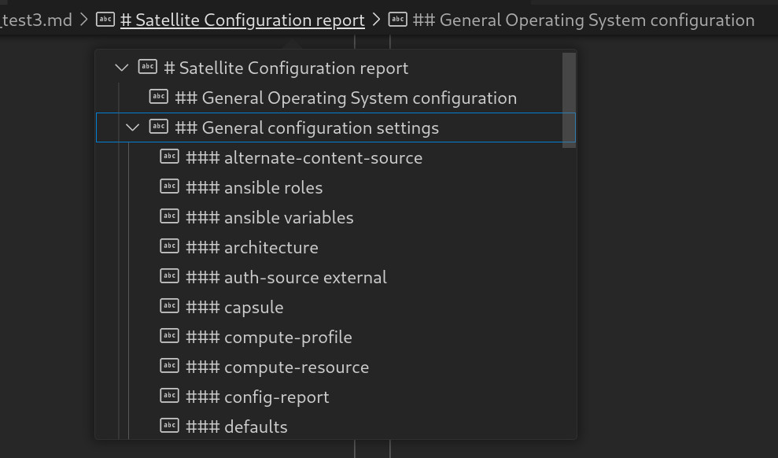

# About satellite-conf-report

satellite-conf-report is a simple tool that uses `hammer` to create a text / Markdown
report of your Satellite configuration. 

It can help in the following cases:

- Reporting the basic configuration of a Satellite system.
- Help with configuration drift - you can compare reports from different dates.
- Quickly share the configuration with others.

## Running satellite-conf-report

You can run [satellite-conf-report.sh](https://raw.githubusercontent.com/frangdlt/satellite-conf-report/main/satellite-conf-report.sh)  
directly in Satellite. Just download the script, and run it. It does not 
perform any change in the running operating system or install
any package/dependency.

Currently the script can take from 5 minutes (in a blank Satellite), to about
15 or 20 on a fully configured Satellite with multiple organizations.

## Analysing the report

You can use any editor that understands Markdown. Output is organised in 
different sections, so you can use your editor to quickly jump from one to another,
as in the screenshot below.

## I want to see examples

Sure! 

- [Output of a satellite-conf-report.sh run](example-run.txt)
- [Generated satellite-conf-report.sh report](example-report.md)

## Known issues

### The tool is slow.

Sure it is! Launching lots of `hammer` commands have a lot of overhead. I'll 
continue tunning which configurations have relevant information and removing
the ones that don't add much value.

### I get hammer errors for some commands.

The `hammer` tool has evolved along the different Satellite versions, and features
get added/dropped as the Satellite evolve.

It's ok if some tasks produce errors, they should be added into the report too.

### I want a programmatic output of this.

Me too! Ideally there should be a way to feed this information into the
Foreman Ansible Modules to get a reproducible Satellite installation, but this
is just the first iteration.

- [Foreman Ansible Modules](https://theforeman.org/plugins/foreman-ansible-modules/)
- [Red Hat Ansible Collection for Satellite](https://console.redhat.com/ansible/automation-hub/repo/published/redhat/satellite/)
- [Red Hat Ansible Collection for Satellite operations](https://console.redhat.com/ansible/automation-hub/repo/published/redhat/satellite_operations/)

# Issues and feedback

Just open a Github issue or send a PR!
